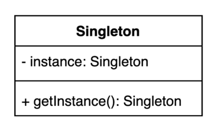

# 01. 싱글톤 (Singleton) 패턴

- 인스턴스를 오직 한개만 제공하는 패턴



## 구현 방법 1

- private 생성자에 static 메소드
- 멀티쓰레드 환경에서 안전하지 않음 (여러 쓰레드가 동시에 접근할 경우 여러 인스턴스가 생길수 있다)

```java
public class Settings {

  private static Settings instance;

  private Settings() {
    // 외부에서 생성하지 못하게 private 으로 지정
  }

  public static Settings getInstance() {
    if (instance == null) {
      instance = new Settings();
    }
    return instance;
  }

}
```

## 구현 방법 2

- 동기화(synchronized)를 사용해 멀티쓰레드 환경에서 안전하게 만드는 방법
- synchronized 특성상 성능이슈가 생길수있다.

```java
public static synchronized Settings getInstance() {
  if (instance == null) {
    instance = new Settings();
  }
  
  return instance;
}
```

## 구현 방법 3

- 이른 초기화 (eager initialization)을 사용하는 방법
- Thread safe 하다.
- 클래스 로딩 시점에 static field 가 초기화 되므로 객체 생성비용이 클 경우 단점이 될 수 있다.

```java
private static final Settings INSTANCE = new Settings();

private Settings() {
}

public static Settings getInstance() {
  return INSTANCE;
}
```

## 구현 방법 4

- double-checked locking
- volatile 키워드를 이용해서 캐시 불일치 이슈를 방지 할 수 있다. (java 1.5 이상)
- 필드에 instance 가 할당되지 않았을 경우에만 synchronized 블록을 실행하므로  
  메서드에 synchronized 처리를 하는것보다 성능상 유리하다.
- instance 가 필요한 시점에 만들수 있다.

```java
public class Settings {

  private static volatile Settings instance;

  private Settings() {
  }

  public static Settings getInstance() {
    if (instance == null) {
      synchronized (Settings.class) {
        if (instance == null) {
          instance = new Settings();
        }
      }
    }
    return instance;
  }

}
```

## 구현 방법 5

- static nested 클래스를 사용하는 방법 (Initialization-on-demand holder)
- 클래스안에 클래스(Holder)를 두어 JVM 의 Class Loader 매커니즘과 Class 가 로드되는 시점을 이용한 방법
- Settings 클래스에는 Holder 클래스의 필드가 없기 때문에 Settings 클래스 로딩 시 Holder 클래스를 초기화하지 않음
- Lazy initialization 방식을 가져가면서 Thread 간 동기화 문제를 동시에 해결 가능

```java
public class Settings {

  private static Settings instance;

  private static class SettingsHolder {
    private static final Settings SETTINGS = new Settings();
  }

  public static Settings getInstance() {
    return SettingsHolder.SETTINGS;
  }

}
```

## 구현 방법 6

- enum 을 사용하는 방법
- enum 은 상수 하나당 인스턴스가 만들어지며, 각각 public static final 로 공개한다.
- 리플렉션을 통해 싱글톤을 깨트리는 공격에 안전하며, 직렬화를 보장한다.

```java
public enum Settings { 
  INSTANCE
}
```

## 싱글톤 패턴을 깨트리는 방법

### 리플렉션 사용

```java
Settings settings = Settings.getInstance();

Constructor<Settings> declaredConstructor = Settings.class.getDeclaredConstructor();
declaredConstructor.setAccessible(true);
Settings settings1 = declaredConstructor.newInstance();

System.out.println(settings == settings1); // false
```

### 직렬화 & 역직렬화 사용

```java
Settings settings = Settings.getInstance();
Settings settings1 = null;
try (ObjectOutput out = new ObjectOutputStream(new FileOutputStream("settings.obj"))) {
    out.writeObject(settings);
}

try (ObjectInput in = new ObjectInputStream(new FileInputStream("settings.obj"))) {
    settings1 = (Settings) in.readObject();
}

System.out.println(settings == settings1); // false
```
