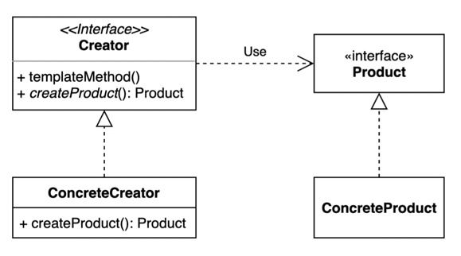

# 02. 팩토리 메소드 (Factory Method) 패턴

- 구체적으로 어떤 인스턴스를 만들지는 서브 클래스가 정하는 패턴
- 다양한 구현체 (Product)가 있고, 그중에서 특정한 구현체를 만들 수 있는 다양한 팩토리 (Creator)를 제공할 수 있다.
- 팩토리들은 객체의 인스턴스를 생성하는 부분을 캡슐화 하기 위해 사용된다.



## 구현 방법

```java
// Product
public interface Pizza {
  void prepare();
  void bake();
  void box();
}

// ConcreteProduct
public class NYStyleCheesePizza implements Pizza { ... }
public class NYStylePepperoniPizza implements Pizza { ... }
public class ChicagoStyleCheesePizza implements Pizza { ... }
public class ChicagoStylePepperoniPizza implements Pizza { ... }
```

```java
// Creator
public interface PizzaStore {
  
    default Pizza orderPizza(String type) {
      Pizza pizza = createPizza(type);
      pizza.prepare();
      pizza.bake();
      pizza.box();
      return pizza;
    }

    // factory method
    Pizza createPizza(String type);
}
```

```java
// ConcreteCreator 1
public class NYPizzaStore extends PizzaStore {
  
  @Override
  public Pizza createPizza(String type) {
    if ("cheese".equals(type)) {
      return new NYStyleCheesePizza();
    } 
    if ("pepperoni".equals(type)) {
      return new NYStylePepperoniPizza();
    }
    throw new IllegalArgumentException();
  }
}

// ConcreteCreator 2
public class ChicagoPizzaStore extends PizzaStore {
  
  @Override
  public Pizza createPizza(String type) {
    if ("cheese".equals(type)) {
      return new ChicagoStyleCheesePizza();
    } 
    if ("pepperoni".equals(type)) {
      return new ChicagoStylePepperoniPizza();
    }
    throw new IllegalArgumentException();
  }
}
```

```java
public static void main(String[] args) {
  PizzaStore nyStore = new NYPizzaStore();
  PizzaStore chicagoStore = new ChicagoPizzaStore();
  
  Pizza pizza = nyStore.orderPizza("cheese");
  Pizza pizza1 = chicagoStore.orderPizza("pepperoni");    
}
```

## Simple Factory

- 객체를 생성하는 역할을 하나의 팩토리 클래스가 전담하게 하는 방법.
- 주어진 입력을 기반으로 다른 유형의 객체를 리턴하는 메소드가 있는 팩토리 클래스.
- 디자인 패턴이라기 보다는 자주 사용되는 프로그래밍 기법으로 보면 된다.

```java
public class PizzaFactory {

  public static Pizza createPizza(String type) {
    if ("cheese".equals(type)) {
      return new CheesePizza();
    } 
    if ("pepperoni".equals(type)) {
      return new PepperoniPizza();
    }
    throw new IllegalArgumentException();
  }
  
}
```
