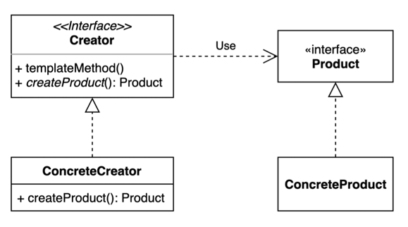

# 03. 추상 팩토리 (Abstract Factory) 패턴

- 서로 연관되거나 의존적인 객체들의 조합을 만드는 인터페이스를 제공하는 패턴
- 구체적으로 어떤 클래스의 인스턴스를(concrete product)를 사용하는지 감출 수 있다.



## 구현 방법

```java
// Product
public interface Frame {
  void shape();
}
public interface Wheel {
  void size();
}

// ConcreteProduct
public class AFrame implements Frame { ... }
public class BFrame implements Frame { ... }
public class AWheel implements Wheel { ... }
public class BWheel implements Wheel { ... }
```

```java
// AbstractFactory
public interface CarFactory {
  Frame createFrame();
  Wheel createWheel();
}

// ConcreteFactory 1
public class ACarFactory implements CarFactory {

  @Override
  public Frame createFrame() {
    return new AFrame();
  }

  @Override
  public Wheel createWheel() {
    return new AWheel();
  }
}

// ConcreteFactory 2
public class BCarFactory implements CarFactory {

  @Override
  public Frame createFrame() {
    return new BFrame();
  }

  @Override
  public Wheel createWheel() {
    return new BWheel();
  }
}
```

```java
// Client 에서 사용할 대상
public class Car {
    private Frame frame;
    private Wheel wheel;

    public Car(Frame frame, Wheel wheel) {
        this.frame = frame;
        this.wheel = wheel;
    }

    public Frame getFrame() {
        return frame;
    }

    public Wheel getWheel() {
        return wheel;
    }
}
```

```java
// Client
public class Client {

  private CarFactory carFactory;

  public Client(CarFactory carFactory) {
    this.carFactory = carFactory;
  }

  public Car createCar() {
    return new Car(carFactory.createFrame(), carFactory.createWheel());
  }
}
```

```java
public static void main(String[] args) {
  Car car = new Client(new ACarFactory());
  System.out.println(car.getFrame().getClass());
  System.out.println(car.getWheel().getClass());

  Car car2 = new Client(new BCarFactory());
  System.out.println(car2.getFrame().getClass());
  System.out.println(car2.getWheel().getClass());
}
```

## 팩토리 메소드 패턴 vs 추상 팩토리 패턴

### 관점

- 팩토리 메소드 패턴은 "팩토리를 구현하는 방법 (inheritance)" 에 초점을 둔다.
- 추상 팩토리 패턴은 "팩토리를 사용하는 방법 (composition)" 에 초점을 둔다.

### 목적

- 팩토리 메소드 패턴은 구체적인 객체 생성 과정을 하위 또는 구체적인 클래스로 옮기는 것이 목적.
- 추상 팩토리 패턴은 관련있는 여러 객체를 구체적인 클래스에 의존하지 않고 만들 수 있게 해주는 것이 목적.
