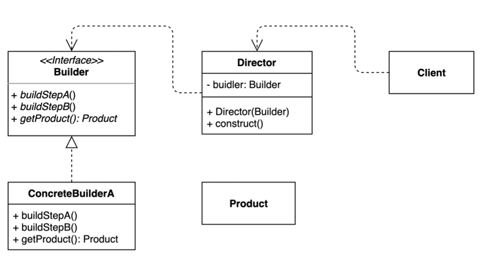

# 04. 빌더 (Builder) 패턴

- 동일한 프로세스를 거쳐 다양한 구성의 인스턴스를 만드는 방법.
- (복잡한) 객체를 만드는 프로세스를 독립적으로 분리할 수 있다.



## 구현 방법

```java
// Builder
public interface ToyBuilder {
  ToyBuilder name(String name);
  ToyBuilder size(int size);
  Toy build();
}

// ConcreteBuilder
public class DefaultToyBuilder implements ToyBuilder {

  private String name;
  private int size;

  @Override
  public ToyBuilder name(String name) {
    this.name = name;
    return this;
  }

  @Override
  public ToyBuilder size(int size) {
    this.size = size;
    return this;
  }

  @Override
  public Toy build() {
    return new Toy(name, size);
  }

}

// Product
public class Toy {
  private String name;
  private int size;
  
  public Toy(String name, String size) {
    this.name = name;
    this.size = size;
  }

  // getter, setter...
}
```

```java
// Director
public class ToyDirector {
 
  private ToyBuilder toyBuilder;
  
  public ToyDirector(ToyBuilder toyBuilder) {
    this.toyBuilder = toyBuilder;
  }
  
  public Toy sampleToy() {
    return toyBuilder.name("sample")
        .size(5)
        .build();
  }
  
}
```

```java
public static void main(String[] args) {
    ToyDirector director = new ToyDirector(new DefaultToyBuilder());
    Toy sampleToy = director.sampleToy();
    System.out.prinln(sampleToy);
}
```

## 장단점

### 장점

- 필요한 데이터만 설정할 수 있다.
- 만들기 복잡한 객체를 순차적으로 만들 수 있다.
- 복잡한 객체를 만드는 구체적인 과정을 숨길 수 있다.
- 동일한 프로세스를 통해 각기 다르게 구성된 객체를 만들 수도 있다. 불완전한 객체를 사용하지 못하도록 방지할 수 있다. 

### 단점

- 원하는 객체를 만들려면 빌더부터 만들어야 한다.
- 구조가 복잡해 진다. (트레이드 오프)

## 사용하는곳

- Java 8 Stream.Builder API
- StringBuilder
- Lombok @Builder
- Spring UriComponentsBuilder
- ...
