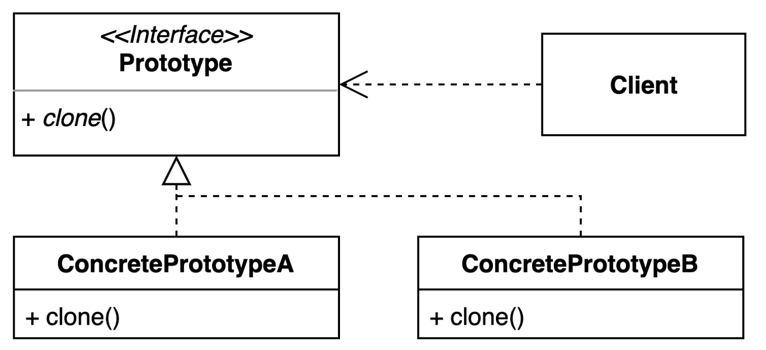

# 05. 프로토타입 (Prototype) 패턴

- 기존 인스턴스를 복제하여 새로운 인스턴스를 만드는 방법.
- 복제 기능을 갖추고 있는 기존 인스턴스를 프로토타입으로 사용해 새 인스턴스를 만들 수 있다.
- 이 패턴은 복사를 위하여 Java 에서는 Object 의 `clone` method 를 활용한다.



## 구현 방법

```java
public class Employees implements Cloneable {

  private final List<String> values;

  public Employees() {
    this(new ArrayList<>());
  }

  public Employees(List<String> values) {
    this.values = values;
  }

  public List<String> getValues() {
    return values;
  }

  public void loadData() {
    values.add("AA");
    values.add("BB");
    values.add("CC");
    values.add("DD");
  }

  // shallow copy 일 경우
  @Override
  public Object clone() throws CloneNotSupportedException {
    return super.clone();
  }

  // deep copy 일 경우
  @Override
  public Object clone() throws CloneNotSupportedException {
    List<String> list = new ArrayList<>(values);
    return new Employees(list);
  }

  @Override
  public boolean equals(Object o) {
    if (this == o) {
      return true;
    }
    if (o == null || getClass() != o.getClass()) {
      return false;
    }
    Employees that = (Employees) o;
    return Objects.equals(values, that.values);
  }

  @Override
  public int hashCode() {
    return Objects.hash(values);
  }

}
```

```java
public static void main(String[] args) throws CloneNotSupportedException {
  Employees employees = new Employees();
  employees.loadData();

  Employees clone = (Employees) employees.clone();

  assert employees != clone;
  assert employees.equals(clone);
  assert employees.getClass() == clone.getClass();

  // shallow copy, depp copy 동일
  assert employees.getValues().equals(clone.getValues());
  
  // shallow copy 일 경우
  assert employees.getValues() == clone.getValues();

  // deep copy 일 경우
  assert employees.getValues() != clone.getValues();
}
```

## Shallow Copy vs Deep Copy

### Shallow Copy

- 객체를 복사할 때, 해당 객체만 복사하여 새 객체를 생성한다.
- 복사된 객체의 인스턴스 변수는 원본 객체의 인스턴스 변수와 참조가 동일하다.

### Deep Copy

- 객체를 복사 할 때, 해당 객체와 인스턴스 변수까지 복사하는 방식.
- 전부를 복사하여 새 주소에 담기 때문에 참조를 공유하지 않는다.

## 장단점

### 장점

- 복잡한 객체를 만드는 과정을 숨길 수 있다.
- 기존 객체를 복제하는 과정이 새 인스턴스를 만드는 것보다 비용(시간 또는 메모리)적인 면에서 효율적일 수도 있다.
- 추상적인 타입을 리턴할 수 있다.

### 단점

- 복제한 객체를 만드는 과정 자체가 복잡할 수 있다. (특히, 순환 참조가 있는 경우)

## 사용하는곳

- Java Object 클래스의 clone 메서드, Cloneable Interface
- ModelMapper
