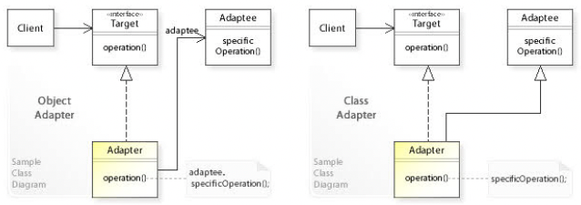

# 06. 어댑터 (Adapter) 패턴

- 기존 코드를 클라이언트가 사용하는 인터페이스의 구현체로 바꿔주는 패턴
- 클라이언트가 사용하는 인터페이스를 따르지 않는 기존 코드를 재사용할 수 있게 해준다.
- 객체 어댑터(Composition 사용) 와 클래스 어댑터(Inheritance 사용) 로 나뉜다.



## 구현 방법

```java
// Target
interface Target {
  void operation();
}

// Adaptee
public class Adaptee {
  
  public void specificOperation() {
    // do something...
  }
  
}

// Object Adapter
public class ObjectAdapter implements Target {

  private final Adaptee adaptee;

  public ObjectAdapter(Adaptee adaptee) {
    this.adaptee = adaptee;
  }

  @Override
  public void operation() {
    adaptee.specificOperation();
  }
  
}

// Class Adapter
public class ClassAdapter extends Adaptee implements Target {

  @Override
  public void operation() {
    super.specificOperation();
  }

}
```

```java
public static void main(String[] args) {
  Target targetObjectAdapter = new ObjectAdapter(new Adaptee());
  Target targetClassAdapter = new ClassAdapter();

  targetObjectAdapter.operation();
  targetClassAdapter.operation();
}
```


## 장단점

### 장점

- 기존 코드를 변경하지 않고 원하는 인터페이스 구현체를 만들어 재사용할 수 있다.
- 기존 코드가 하던 일과 특정 인터페이스 구현체로 변환하는 작업을 각기 다른 클래스로 분리하여 관리할 수 있다.

### 단점

- 새 클래스가 생겨 복잡도가 증가할 수 있다.  
  경우에 따라서는 기존 코드가 해당 인터페이스(Target)를 구현하도록 수정하는 것이 좋은 선택이 될 수도 있다.
