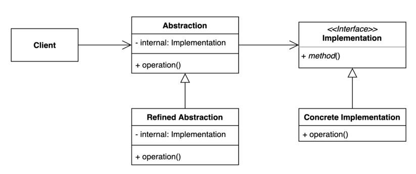

# 07. 브릿지 (Bridge) 패턴

- 추상적인 것과 구체적인 것을 분리하여 연결하는 패턴
- Composition 사용
- 하나의 계층 구조일 때 보다 각기 나누었을 때 독립적인 계층 구조로 발전 시킬 수 있다.
- 구현부에서 추상층을 분리하여 각자 독립적으로 변형이 가능하고 확장이 가능하도록 한다.



## 구현 방법

```java
// Abstraction
public class Shape {

  private final Color color;
  private final String name;

  public Shape(Color color, String name) {
    this.color = color;
    this.name = name;
  }

  public void printInfo() {
    System.out.printf("%s %s\n", color.getValue(), this.name);
  }
  
}

// Refined Abstraction 1
public class Triangle extends Shape {

  public Triangle(Color color) {
    super(color, "triangle");
  }

  // 기능 추가...
  
}

// Refined Abstraction 1
public class Pentagon extends Shape {

  public Triangle(Color color) {
    super(color, "pentagon");
  }

  // 기능 추가...

}
```

```java
// Implementation
public interface Color {
  String getValue();
}

// Concrete Implementation 1
public class Green implements Color {
  public void getValue(){
    return "green";
  }
}

// Concrete Implementation 2
public class Red implements Color {
  public void getValue(){
    return "red";
  }
}
```

```java
public static void main(String[] args) {
  Shape triangle = new Triangle(new Red());
  triangle.printInfo();

  Shape pentagon = new Pentagon(new Green());
  pentagon.printInfo();
}
```

## 장단점

### 장점

- 추상적인 코드를 구체적인 코드 변경 없이도 독립적으로 확장할 수 있다. (OCP)
- 추상적인 코드과 구체적인 코드를 분리할 수 있다. (SRP)

### 단점

- 계층 구조가 늘어나 복잡도가 증가할 수 있다.
