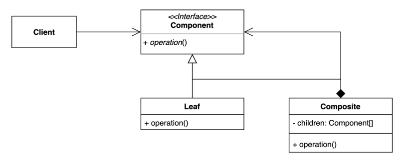

# 08. 컴포지트 (Composite) 패턴

- 그룹 전체와 개별 객체를 동일하게 처리할 수 있는 패턴.
- 클라이언트 입장에서는 ‘전체’나 ‘부분’이나 모두 동일한 컴포넌트로 인식할 수는 계층 구조 를 만든다. (Part-Whole Hierarchy)



## 구현 방법

```java
// Component
public interface Validator {
  void validate(String input);
}

// Leaf 1
public class EmptyValidator implements Validator {
  
  @Override
  public void validate(String input) {
    if (isEmpty(input)) {
      throw new IllegalArgumentException("input must not be empty");
    }
  }

  private boolean isEmpty(String input) {
    return input == null || input.isEmpty();
  }
}

// Leaf 2
public class InputPatternValidator implements Validator {
  
  private static final Pattern PATTERN = Pattern.compile("^\\d+ [-+*/] \\d+$");

  @Override
  public void validate(String input) {
    if (!PATTERN.matcher(input).matches()) {
      throw new IllegalArgumentException("invalid input pattern");
    }
  }
}

// Composite
public class CompositeValidator implements Validator {

  private final List<Validator> validators;

  public CompositeValidator(Validator... validators) {
    this.validators = Arrays.asList(validators);
  }

  @Override
  public void validate(String input) {
    validators.forEach(validator -> validator.validate(input));
  }
}
```

```java
public static void main(String[] args) {
  Validator validator =  new CompositeValidator(new EmptyValidator(), new InputPatternValidator());
  validator.validate("10 + 25");
}
```

## 장단점

### 장점

- 복잡한 트리 구조를 편리하게 사용할 수 있다.
- 다형성과 재귀를 활용할 수 있다.
- 클라이언트 코드를 변경하지 않고 새로운 엘리먼트 타입을 추가할 수 있다.

### 단점

- 트리를 만들어야 하기 때문에 (공통된 인터페이스를 정의해야 하기 때문에) 지나치게 일반화 해야 하는 경우도 생길 수 있다.
