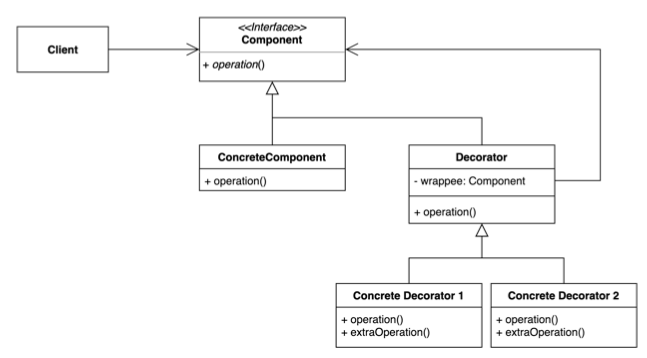

# 09. 데코레이터 (Decorator) 패턴

- 기존 코드를 변경하지 않고 부가 기능을 추가하는 패턴
- 상속이 아닌 위임(Delegation)을 사용해서 보다 유연하게(런타임에) 부가 기능을 추가하는 것도 가능하다.
- 위임이란 어떤 행위를 위임 관계에 있는 객체에게 넘겨서 처리하는 것을 의미한다. Composition + Forwarding 이라고 보면 될 것 같다.
- Decorator 의 경우 Wrapper 라고도 한다.



## 구현 방법

```java
// Component
interface ChristmasTree {
  String decorate();
}

// ConcreteComponent
public class DefaultChristmasTree implements ChristmasTree {
  
  @Override
  public String decorate() {
    return "Christmas tree";
  }
  
}
```

```java
// Decorator
public class TreeDecorator implements ChristmasTree {
  
  private final ChristmasTree christmasTree;

  public TreeDecorator(ChristmasTree christmasTree) {
    this.christmasTree = christmasTree;
  }

  @Override
  public String decorate() {
    return christmasTree.decorate();
  }
  
}

// Concrete Decorator 1
public class LightsTreeDecorator extends TreeDecorator {

  public LightsTreeDecorator(ChristmasTree christmasTree) {
    super(christmasTree);
  }
  
  @Override
  public String decorate() {
    return super.decorate() + addLights();
  }

  private String addLights() {
    return " with Lights";
  }
  
}

// Concrete Decorator 2
public class FlowersTreeDecorator extends TreeDecorator {

  public FlowersTreeDecorator(ChristmasTree christmasTree) {
    super(christmasTree);
  }

  @Override
  public String decorate() {
    return super.decorate() + addFlowers();
  }

  private String addFlowers() {
    return " with Flowers";
  }
  
}
```

```java
public static void main(String[] args) {
  ChristmasTree tree = new FlowersTreeDecorator(new LightsTreeDecorator(new DefaultChristmasTree()));

  // Christmas tree with Lights with Flowers 
  System.out.println("tree: " + tree.decorate()); 
}
```

## 장단점

### 장점

- 새로운 클래스를 만들지 않고 기존 기능을 조합할 수 있다.
- 컴파일 타임이 아닌 런타임에 동적으로 기능을 변경할 수 있다.

### 단점

- 데코레이터를 조합하는 코드가 복잡할 수 있다.

## 사용하는곳

- InputStream, OutputStream, Reader, Writer 의 생성자를 활용한 Wrapper
- java.util.Collections 가 제공하는 메서드들 활용한 Wrapper(checked 로 시작하거나 synchronized 로 시작하는 메서드)
- javax.servlet.http.HttpServletRequest/ResponseWrapper
