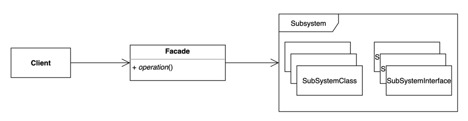

# 10. 퍼사드 (Facade) 패턴

- 복잡한 서브 시스템 의존성을 최소화하는 방법.
- 클라이언트가 사용해야 하는 복잡한 서브 시스템 의존성을 간단한 인터페이스로 추상화 할 수 있다.
- 클린코드에서 말하는 깨끗한 경계와 비슷한 맥락으로 보인다.
- Facade 는 "건물의 정면"을 의미하는 단어이다.



## 구현 방법

```java
// Facade
public class GoOffice {

  public void goToWork() {
    Wash wash = new Wash();
    Breakfast breakfast = new Breakfast();
    Move move = new Move();

    wash.brushTeeth();
    wash.shower();
    breakfast.eat();
    breakfast.water();
    move.bus();
  }
  
}

// Sub System 1
public class Wash {
  
  public void brushTeeth() {
    System.out.println("Brush my teeth");
  }

  public void shower() {
    System.out.println("Take a shower");
  }
  
}

// Sub System 2
public class Breakfast {
  
  public void eat() {
    System.out.println("Have breakfast");
  }

  public void water() {
    System.out.println("Drink water");
  }
  
}

// Sub System 3
public class Move {
  
  public void bus() {
    System.out.println("Take the bus");
  }
  
}
```

```java
public static void main(String[] args) {
  GoOffice goOffice = new GoOffice();
  goOffice.goToWork();
}
```

## 장단점

### 장점

- 서브 시스템에 대한 의존성을 한곳으로 모을 수 있다.

### 단점

- 퍼사드 클래스가 서브 시스템에 대한 모든 의존성을 가지게 된다.

## 사용하는곳

- SLF4J (Simple Logging Facade for Java)
