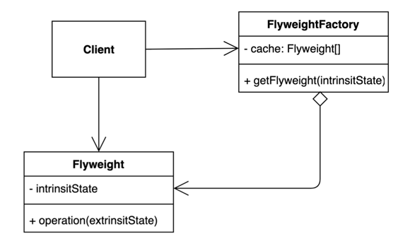

# 11. 플라이웨이트 (Flyweight) 패턴

- 객체를 가볍게 만들어 메모리 사용을 줄이는 패턴.
- 자주 변하는 속성(또는 외적인 속성, extrinsic)과 변하지 않는 속성(또는 내적인 속성, intrinsic)을 분리하고 재사용하여 메모리 사용을 줄일 수 있다.
- 재사용되는 객체는 공유되기 때문에 Immutable 해야 한다.
- 공통의 요소를 공유하여 메모리를 절약하므로 캐싱으로 볼 수 있다.



## 구현 방법

```java
// Flyweight
public final class Font {

  private final String family;
  private final int size;

  public Font(String family, int size) {
    this.family = family;
    this.size = size;
  }

  public String getFamily() {
    return family;
  }

  public int getSize() {
    return size;
  }
  
}

// Flyweight Factory
public class FontFactory {

  private static final Map<String, Font> CACHE = new HashMap<>();

  public static Font getFont(String font) {
    Font result = CACHE.get(font);
    if (result == null) {
      String[] split = font.split(":");
      result = new Font(split[0], Integer.parseInt(split[1]));
      cache.put(font, result);
    }
    
    return result;
  }
  
}
```

```java
public static void main(String[] args) {
    Font font1 = FontFactory.getFont("Arial:12");
    Font font2 = FontFactory.getFont("Arial:12");

    assert font1 == font2;
}
```

## 장단점

### 장점

- 애플리케이션에서 사용하는 메모리를 줄일 수 있다.

### 단점

- 코드의 복잡도가 증가한다.

## 사용하는곳

- Integer.valueOf(int), -128 ~ 127 까지 캐싱한다.
