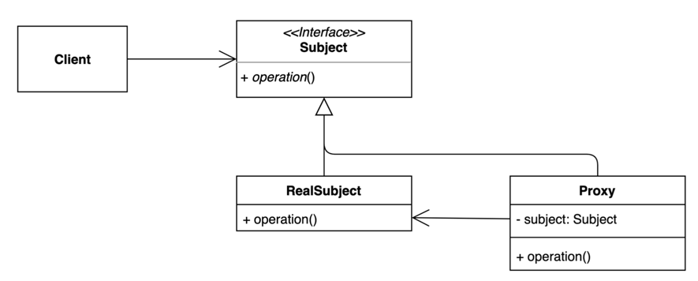

# 12. 프록시 (Proxy) 패턴

- 특정 객체에 대한 접근을 제어하거나 기능을 추가할 수 있는 패턴.
- 초기화 지연, 접근 제어, 로깅, 캐싱 등 다양하게 응용해 사용 할 수 있다.



## 구현 방법

```java
// Subject
public interface OrderService {
  void order();
}

// RealSubject
public class DefaultOrderService implements OrderService {

  @Override
  public void order() {
    System.out.println("주문하기...");
  }
  
}

// Proxy
public class OrderServiceProxy implements OrderService {

  private OrderService orderService;

  @Override
  public void startGame() {
    long before = System.currentTimeMillis();
    
    if (this.orderService == null) {
      this.orderService = new DefaultOrderService();
    }

    orderService.order();

    System.out.println(System.currentTimeMillis() - before);
  }
  
}
```

```java
public static void main(String[] args) {
  OrderService orderService = new OrderServiceProxy();
  orderService.order();
}
```

## 장단점

### 장점

- 기존 코드를 변경하지 않고 새로운 기능을 추가할 수 있다.
- 기존 코드가 해야 하는 일만 유지할 수 있다.
- 기능 추가 및 초기화 지연 등으로 다양하게 활용할 수 있다.

### 단점

 - 코드의 복잡도가 증가한다.

## 사용하는곳

- Java 다이나믹 프록시, java.lang.reflect.Proxy
- Spring AOP

## 데코레이터 패턴 vs 프록시 패턴

- 데코레이터 패턴은 Real Class 의 기능에 다른 기능을 추가(확장) 하는것이 목적이다.
- 프록시 패턴은 Real Class 의 접근에 대한 제어가 목적이다.
