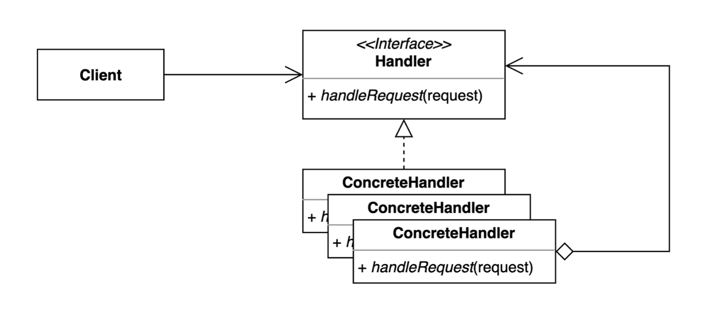

# 13. 책임 연쇄 패턴 (Chain Of Responsibility) 패턴

- 요청을 보내는 쪽(sender)과 요청을 처리하는 쪽(receiver)의 분리하는 패턴
- 클라이언트의 요청을 처리하기 위해 객체들을 체인 형태로 연결하여 결합력을 낮추기 위해 사용한다.
- 핸들러 체인을 사용해서 요청을 처리한다.



## 구현 방법

```java
// Handler
public abstract class RequestHandler {

  private RequestHandler nextHandler;

  public RequestHandler() {
    this(null);
  }

  public RequestHandler(RequestHandler nextHandler) {
    this.nextHandler = nextHandler;
  }

  public void handle(String request) {
    if (nextHandler != null) {
      nextHandler.handle(request);
    }
  }
  
}

// ConcreteHandler 1
public class Logging1RequestHandler extends RequestHandler {

  public LoggingRequestHandler(RequestHandler nextHandler) {
    super(nextHandler);
  }

  @Override
  public void handle(String request) {
    System.out.println("log1...");
    super.handle(request);
  }
  
}

// ConcreteHandler 2
public class Logging2RequestHandler extends RequestHandler {

  public LoggingRequestHandler(RequestHandler nextHandler) {
    super(nextHandler);
  }

  @Override
  public void handle(String request) {
    System.out.println("log2...");
    super.handle(request);
  }

}

// Client
public class Client {

  private RequestHandler requestHandler;

  public Client(RequestHandler requestHandler) {
    this.requestHandler = requestHandler;
  }

  public void invoke() {
    System.out.println("start...");
    requestHandler.handle("request");
  }
  
}
```

```java
public static void main(String[] args) {
  RequestHandler chain = new Logging1RequestHandler(new Logging2RequestHandler());
  Client client = new Client(chain);
  client.invoke();
}
```

## 장단점

### 장점

- 클라이언트 코드를 변경하지 않고 새로운 핸들러를 체인에 추가할 수 있다.
- 각각의 체인은 자신이 해야하는 일만 한다. 
- 체인을 다양한 방법으로 구성할 수 있다.

### 단점

- 디버깅 및 테스트가 쉽지 않을수 있다.
- 체인이 적절하게 구성되어 있지 않을 경우 요청이 올바르게 처리되지 않을수있다.

## 사용하는곳

- 자바 서블릿 필터
- 스프링 시큐리티 필터
