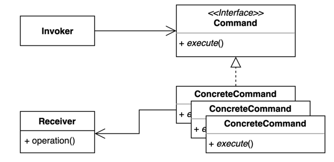

# 14. 커맨드 (Command) 패턴

- 요청을 캡슐화 하여 호출자(invoker)와 수신자(receiver)를 분리하는 패턴.
- 요청을 처리하는 방법이 바뀌더라도, 호출자의 코드는 변경되지 않는다.



## 구현 방법

```java
// Invoker
public class Button {
  
  private Command command;
  
  public Button(Command command) {
    this.command = command;
  }
  
  public void press() {
    command.execute();
  }

  public void changeCommand(Command command) {
    this.command = command;
  }
  
}

// Command
public interface Command {
  void execute();
}

// Concrete Command 1
public class LightOnCommand implements Command {

  private final Light light;

  public LightOnCommand(Light light) {
    this.light = light;
  }

  @Override
  public void execute() {
    light.on();
  }

}

// Concrete Command 2
public class DoorOpenCommand implements Command {

  private final Door door;

  public DoorOpenCommand(Door door) {
    this.door = door;
  }

  @Override
  public void execute() {
    door.open();
  }

}

// Receiver 1
public class Light {

  public void on() {
    System.out.println("불을 켭니다.");
  }

}

// Receiver 2
public class Door {

  public void open() {
    System.out.println("문을 엽니다.");
  }

}
```

```java
public static void main(String[] args) { 
  Button button = new Button(new LightOnCommand(new Light()));
  button.press();
  
  button.changeCommand(new DoorOpenCommand(new Door()));
  button.press();
}
```

## 장단점

## 장점
- 기존 코드를 변경하지 않고 새로운 커맨드를 만들 수 있다.
- 수신자의 코드가 변경되어도 호출자의 코드는 변경되지 않는다.
- 커맨드 객체를 로깅, DB에 저장, 네트워크로 전송 하는 등 다양한 방법으로 활용할 수도 있다.

## 단점

- 코드가 복잡하고 클래스가 많아진다.

## 사용하는곳

- 자바 Runnable, 람다
- 스프링 SimpleJdbcInsert, SimpleJdbcCall
