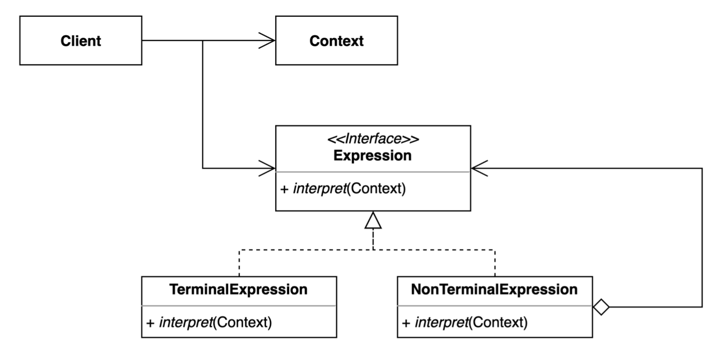

# 15. 인터프리터 (Interpreter) 패턴

- 자주 등장하는 문제를 간단한 언어로 정의하고 재사용하는 패턴.
- 반복되는 문제 패턴을 언어 또는 문법으로 정의하고 확장할 수 있다.



- Expression
  - Abstract Syntax Tree(AST) 의 모든 노드에서 사용할 Interpret 작업을 정의한다.
- Terminal Expression
  - 그 자체로 종료가 되는 Expression
- NoNTerminal Expression
  - 재귀적으로 다른 Expression 을 참조하고 있는 Expression


## 구현 방법

```java
// Expression
public interface Expression {
  boolean interpret(String context);
}

// TerminalExpression
public class TerminalExpression implements Expression {

  private String data;

  public TerminalExpression(String data) {
    this.data = data;
  }

  @Override
  public boolean interpret(String context) {
    return context.contains(data);
  }
  
}

// NonTerminalExpression 1
public class AndExpression implements Expression {

  private Expression expr1;
  private Expression expr2;

  public AndExpression(Expression expr1, Expression expr2) {
    this.expr1 = expr1;
    this.expr2 = expr2;
  }

  @Override
  public boolean interpret(String context) {
    return expr1.interpret(context) && expr2.interpret(context);
  }
  
}

// NonTerminalExpression 2
public class OrExpression implements Expression {

  private Expression expr1;
  private Expression expr2;

  public OrExpression(Expression expr1, Expression expr2) {
    this.expr1 = expr1;
    this.expr2 = expr2;
  }

  @Override
  public boolean interpret(String context) {
    return expr1.interpret(context) || expr2.interpret(context);
  }
  
}
```

```java
public class Client {

  public static void main(String[] args) {
    Expression isMale = getMaleExpression();
    Expression isMarriedWoman = getMarriedWomanExpression();

    System.out.println("John is male? " + isMale.interpret("John male"));
    System.out.println("Julie is a married women? " + isMarriedWoman.interpret("Married Julie"));
  }

  public static Expression getMaleExpression() {
    Expression robert = new TerminalExpression("Robert");
    Expression john = new TerminalExpression("John");
    return new OrExpression(robert, john);
  }

  public static Expression getMarriedWomanExpression() {
    Expression julie = new TerminalExpression("Julie");
    Expression married = new TerminalExpression("Married");
    return new AndExpression(julie, married);
  }
  
}
```

## 장단점

## 장점

- 자주 등장하는 문제 패턴을 언어와 문법으로 정의할 수 있다.
- 기존 코드를 변경하지 않고 새로운 Expression 을 추가할 수 있다.

## 단점

- 복잡한 문법을 표현하려면 Expression 과 Parser 가 복잡해진다.

## 사용하는곳

- Java 컴파일러, 정규표현식
- SPEL (Spring Expression Language)
