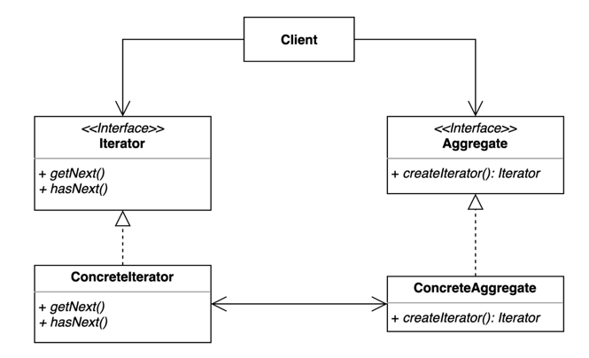

# 16. 반복자 (Iterator) 패턴

- 집합 객체 내부 구조를 노출시키지 않고 순회 하는 방법을 제공하는 패턴.
- 집합 객체를 순회하는 클라이언트 코드를 변경하지 않고 다양한 순회 방법을 제공할 수 있다.



- Iterator: 컬렉션의 요소들을 순서대로 검색하기 위한 인터페이스
- ConcreteIterator: iterator 인터페이스 구현체
- Aggregate: 여러 요소들로 구성된 컬렉션 인터페이스
- ConcreteAggregate: Aggregate 인터페이스 구현체

## 구현 방법

```java
// Iterator
public interface Iterator<T> {
  boolean hasNext();
  T next();
}

// ConcreteIterator
public class BookIterator implements Iterator<Book> {
  
  private final BookAggregate bookAggregate;
  private int index;

  public BookIterator(BookAggregate bookAggregate) {
    this.bookAggregate = bookAggregate;
    this.index = 0;
  }

  @Override
  public boolean hasNext() {
    return index < bookAggregate.getLength();
  }

  @Override
  public Book next() {
    Book book = bookAggregate.getBookAt(index);
    index++;
    return book;
  }
  
}

// Aggregate
public interface Aggregate {
  Iterator<T> iterator();
}

// ConcreteAggregate
public class BookAggregate implements Aggregate {
  
  private final Book[] books;
  private int last = 0;

  public BookAggregate(int maxsize) {
    this.books = new Book[maxsize];
  }

  public Book getBookAt(int index) {
    return books[index];
  }

  public void appendBook(Book book) {
    this.books[last] = book;
    last++;
  }

  public int getLength() {
    return last;
  }

  @Override
  public Iterator<T> iterator() {
    return new BookIterator(this);
  }
  
}

// Target
public class Book {
  
  private final String name;

  public Book(String name) {
    this.name = name;
  }

  public String getName() {
    return name;
  }
  
}
```

```java
public static void main(String[] args) {
  BookAggregate bookAggregate = new BookAggregate(3);
  bookAggregate.appendBook(new Book("자바"));
  bookAggregate.appendBook(new Book("파이썬"));
  bookAggregate.appendBook(new Book("golang"));

  Iterator<Book> iterator = bookAggregate.iterator();
  while(iterator.hasNext()){
    System.out.println(iterator.next().getName());
  }
}
```

## 장단점

## 장점

- 집합 객체가 가지고 있는 객체들에 손쉽게 접근할 수 있다.
- 일관된 인터페이스를 사용해 여러 형태의 집합 구조를 순회할 수 있다

## 단점

- 클래스가 늘어나고 복잡도가 증가한다.

## 사용하는곳

- Java, Enumeration, Iterator
- Java StAX (Streaming API for XML)의 Iterator 기반 API
  - XmlEventReader, XmlEventWriter
- Spring, CompositeIterator
