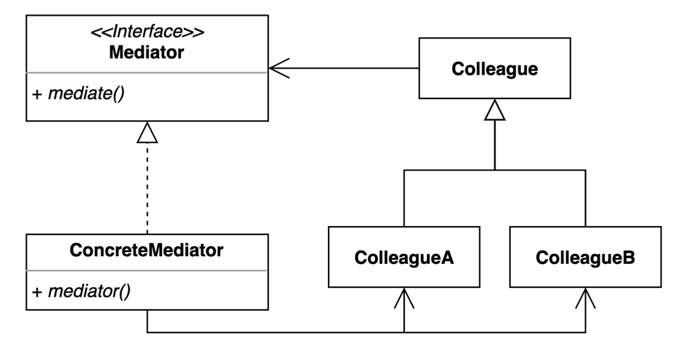

# 17. 중재자 (Mediator) 패턴

- 여러 객체들이 소통하는 방법을 캡슐화하는 패턴.
- 여러 컴포넌트간의 결합도를 중재자를 통해 낮출 수 있다.
- M:N의 관계에서 M:1의 관계로 복잡도를 떨어뜨려 유지 보수 및 재사용, 확장성에 유리한 패턴이다.



## 구현 방법

```java
// Mediator
public interface Mediator {
  void addUser(Colleague user);
  void sendMessage(String message, Colleague user);
}

// ConcreteMediator
public class ConcreteMediator implements Mediator {

  private final List<Colleague> users;

  public ConcreteMediator() {
    this.users = new ArrayList<>();
  }

  @Override
  public void addUser(Colleague user) {
    this.users.add(user);
  }

  @Override
  public void sendMessage(String message, Colleague user) {
    for (Colleague u : this.users) {
      if (u != user) {
        u.receive(message);
      }
    }
  }
  
}

// Colleague
public abstract class Colleague {

  protected Mediator mediator;
  protected String name;

  public Colleague(Mediator mediator, String name) {
    this.mediator = mediator;
    this.name = name;
  }

  public abstract void send(String msg);

  public abstract void receive(String msg);
}

// ColleagueA
public class ConcreteColleague extends Colleague {

  public ConcreteColleague(Mediator mediator, String name) {
    super(mediator, name);
  }

  @Override
  public void send(String msg) {
    System.out.println(this.name + ": Sending Message=" + msg);
    mediator.sendMessage(msg, this);
  }

  @Override
  public void receive(String msg) {
    System.out.println(this.name + ": Received Message:" + msg);
  }
  
}
```

```java
public static void main(String[] args) {
  Mediator mediator = new ConcreteMediator();
  
  Colleague user1 = new ConcreteColleague(mediator, "aaa");
  Colleague user2 = new ConcreteColleague(mediator, "bbb");
  Colleague user3 = new ConcreteColleague(mediator, "ccc");
  Colleague user4 = new ConcreteColleague(mediator, "ddd");
  
  mediator.addUser(user1);
  mediator.addUser(user2);
  mediator.addUser(user3);
  mediator.addUser(user4);

  user1.send("message....");
}
```

## 장단점

## 장점

- 컴포넌트 코드를 변경하지 않고 새로운 중재자를 만들어 사용할 수 있다.
- 각각의 컴포넌트 코드를 보다 간결하게 유지할 수 있다.

## 단점

- 중재자 역할을 하는 클래스의 복잡도와 결합도가 증가한다.

## 사용하는곳

- Java, ExecutorService, Executor
- Spring, DispatcherServlet

## 퍼사드 패턴 vs 중재자 패턴

- 퍼사드 패턴은 서브 시스템 의존성을 간단한 인터페이스로 추상화하여 상호 작용을 캡슐화 하므로 단방향이다.
- 중재자 패턴은 여러 컴포넌트간의 결합도를 중재자를 통해 낮추는것으로 양방향이다.
