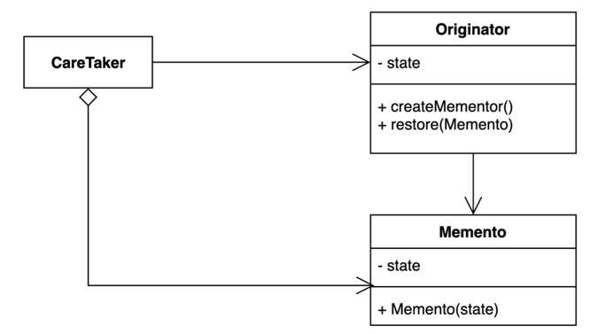

# 18. 메멘토 (Memento) 패턴

- 캡슐화를 유지하면서 객체 내부 상태를 외부에 저장하는 방법.
- 객체 상태를 외부에 저장했다가 해당 상태로 다시 복구할 수 있다.
- 토큰이라고 보면 될 것 같다.



- CareTaker
  - Memento 의 보관을 책임지며 메멘토의 내용을 검사하거나 그 내용을 건드리지는 않는다.
- Originator
  - 자체적으로 현재의 state 를 저장하는 Memento 객체를 생성할 수 있다.
  - state 를 복원하기 위해 Memento 를 사용한다.
- Memento
  - Originator 의 state 에 대한 스냅샷 역할을 하는 객체
  - 특정 시점의 상태 정보를 저장하므로 Immutable 해야함.

## 구현 방법

```java
// CareTaker
public class Storage {
  
  private final Stack<GameSave> history = new Stack<>();

  public void save(GameSave gameSave) {
    history.push(gameSave);
  }

  public GameSave load() {
    if (!stack.empty()) {
      return history.pop();
    }
    throw new IllegalStateException(); 
  }
  
}

// Originator
public class Game {

  private int level;
  private int score;
  
  public int getLevel() {
    return level;
  }
  
  public void setLevel(int level) {
    this.level = level;
  }

  public int getScore() {
    return score;
  }
  
  public void setScore(int score) {
    this.score = score;
  }

  public GameSave save() {
    return new GameSave(level, score);
  }

  public void restore(GameSave gameSave) {
    this.level = gameSave.getLevel();
    this.score = gameSave.getScore();
  }

}

// Memento
public final class GameSave {

  private final int level;
  private final int score;

  public GameSave(int level, int score) {
    this.level = level;
    this.score = score;
  }

  public int getLevel() {
    return level;
  }

  public int getScore() {
    return score;
  }

}
```

```java
public static void main(String[] args) {
  Storage storage = new Storage();
  
  Game game = new Game();
  game.setLevel(100);
  game.setScore(3);

  GameSave gameSave = game.save();
  storage.save(gameSave);

  game.setLevel(200);
  game.setScore(6);

  GameSave loadedGameSave = storage.load();
  game.restore(loadedGameSave);

  System.out.println(game.getLevel()); // 100
  System.out.println(game.getScore()); // 3
}
```

## 장단점

## 장점

- 캡슐화를 지키면서 상태 객체 상태 스냅샷을 만들 수 있다.
- 객체 상태 저장하고 또는 복원하는 역할을 CareTaker 에게 위임할 수 있다. 
- 객체 상태가 바뀌어도 클라이언트 코드는 변경되지 않는다.

## 단점

- 많은 정보를 저장하는 Memento 를 자주 생성하는 경우 메모리 사용량에 많은 영향을 줄 수 있다.
