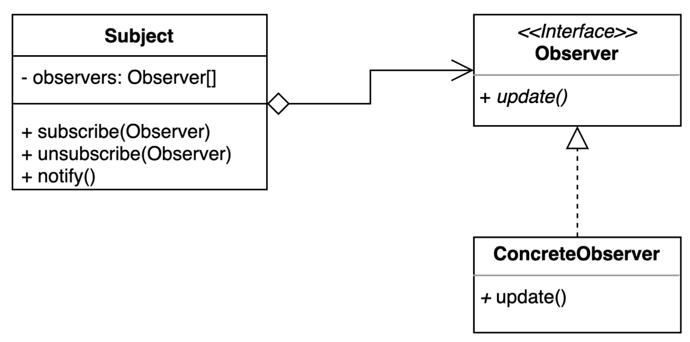

# 19. 옵저버 (Observer) 패턴

- 다수의 객체가 특정 객체 상태 변화를 감지하고 알림을 받는 패턴.
- 발행(publish)-구독(subscribe) 패턴을 구현할 수 있다.



## 구현 방법

```java
// Subject
public class ChatServer {

  private Map<String, List<Subscriber>> subscribers = new HashMap<>();

  public void register(String subject, Subscriber subscriber) {
    if (this.subscribers.containsKey(subject)) {
      this.subscribers.get(subject).add(subscriber);
    } else {
      List<Subscriber> list = new ArrayList<>();
      list.add(subscriber);
      this.subscribers.put(subject, list);
    }
  }

  public void unregister(String subject, Subscriber subscriber) {
    if (this.subscribers.containsKey(subject)) {
      this.subscribers.get(subject).remove(subscriber);
    }
  }

  public void sendMessage(User sender, String subject, String message) {
    if (this.subscribers.containsKey(subject)) {
      String userMessage = "[ send ] " + sender.getName() + ": " + message;
      this.subscribers.get(subject).forEach(s -> s.handleMessage(userMessage));
    }
  }

}

// Observer
public interface Subscriber {
  void handleMessage(String message);
}

// ConcreteObserver
public class User implements Subscriber {

  private String name;

  public User(String name) {
    this.name = name;
  }

  public String getName() {
    return name;
  }

  @Override
  public void handleMessage(String message) {
    System.out.println("[handle] " + name + ": " + message);
  }
  
}
```

```java
public static void main(String[] args) {
  ChatServer chatServer = new ChatServer();
  
  User user1 = new User("aaa");
  User user2 = new User("bbb");

  chatServer.register("subject1", user1);
  chatServer.register("subject1", user2);

  chatServer.register("subject2", user1);
  chatServer.register("subject2", user2);

  chatServer.sendMessage(user1, "subject1", "subject1 + message1...");
  chatServer.sendMessage(user2, "subject1", "subject1 + message2...");

  chatServer.unregister("subject2", user1);
    
  chatServer.sendMessage(user2, "subject2", "subject2 + message3...");
}
```

```text
>> console <<
[ send ] aaa: subject1 + message1...
[handle] aaa: subject1 + message1...
[handle] bbb: subject1 + message1...
[ send ] bbb: subject1 + message2...
[handle] aaa: subject1 + message2...
[handle] bbb: subject1 + message2...
[ send ] bbb: subject2 + message3..
[handle] bbb: subject2 + message3...
```

## 장단점

## 장점

- 상태를 변경하는 객체(publisher)와 변경을 감지하는 객체(subscriber)의 관계를 느슨하게 유지할 수 있다.
- Subject 의 상태 변경을 주기적으로 조회하지 않고 자동으로 감지할 수 있다. 
- 런타임에 옵저버를 추가하거나 제거할 수 있다.

## 단점

- 복잡도가 증가한다.
- 다수의 Observer 객체를 등록 이후 해지 않는다면 memory leak 이 발생할 수도 있다

## 사용하는곳

- Java, Observable 과 Observer (자바 9부터 deprecated)
- Java 9 이후, PropertyChangeListener, PropertyChangeEvent
- Java 9 이후, Flow API
- Spring, ApplicationContext ApplicationEvent
