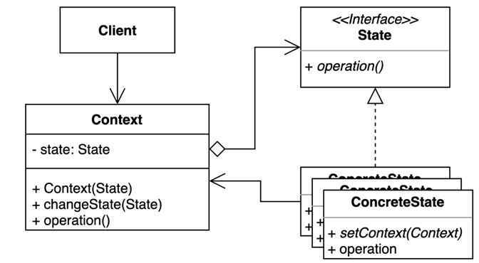

# 20. 상태 (State) 패턴

- 객체 내부 상태 변경에 따라 객체의 행동이 달라지는 패턴.
- 상태에 특화된 행동들을 분리해 낼 수 있으며, 새로운 행동을 추가하더라도 다른 행동에 영향을 주지 않는다.
- 상태를 객체화 하여 상태가 행동을 할 수 있도록 위임한다.
- 상태 처리 방법
  1. State 에 Context 를 필드로 주입받는다.
  2. State 메서드에 Context 를 전달한다.
  3. State 메서드에서 처리후에 다른 State 를 리턴한다.



## 구현 방법

```java
// Context
public class Light {
  
  private State state;

  public Light() {
    this.state = new Off();
  }

  public void press() {
    this.state = state.press();
  }
  
  public void changeState(State state) {
    this.state = state;
  }
  
}

// State
public interface State {
  State press();
}

// ConcreteState 1
public class On implements State {
  
  public State press() {
    System.out.println("On -> Off");
    return new Off();
  }
  
}

// ConcreteState 2
public class Off implements State {

  public State press() {
    System.out.println("Off -> On");
    return new On();
  }

}
```

```java
public static void main(String[] args) {
  Light light = new Light();     // State: Off
  light.press();  // Off -> On 출력, State: On
  light.press();  // On -> Off 출력, State: Off
  
  light.changeState(new On());   // State: On
  light.press();  // On -> Off 출력, State: Off
}
```

## 장단점

## 장점

- 상태에 따른 동작을 개별 클래스로 옮겨서 관리할 수 있다.
- 기존의 특정 상태에 따른 동작을 변경하지 않고 새로운 상태에 다른 동작을 추가할 수 있다. 
- 코드 복잡도를 줄일 수 있다

## 단점

- 복잡도가 증가한다.
