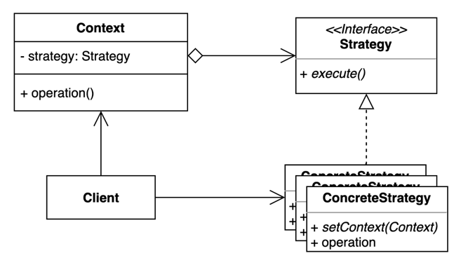

# 21. 전략 (Strategy) 패턴

- 여러 알고리즘을 캡슐화하고 상호 교환 가능하게 만드는 패턴.
- 컨텍스트에서 사용할 알고리즘을 클라이언트 선택한다.
- Client 가 Strategy 를 주입해주는 방식
  - 생성자를 통해 주입
  - 메서드 파라미터로 주입



## 구현 방법

```java
// Context
public class Car {
  
  public void drive(Speed speed) {
    speed.drive();
  }
  
}

// Strategy
public interface Speed {
  void drive();
}

// ConcreteStrategy 1
public class Normal implements Speed {
  
  @Override
  public void drive() {
    System.out.println("drive speed: normal...");
  }
  
}

// ConcreteStrategy 2
public class Slow implements Speed {

  @Override
  public void drive() {
    System.out.println("drive speed: Slow...");
  }

}
```

```java
public static void main(String[] args) {
    Car car = new Car();
    
    car.drive(new Normal());
    car.drive(new Slow());
}
```

## 장단점

### 장점

- 새로운 전략을 추가하더라도 기존 코드를 변경하지 않는다.
- 상속 대신 위임을 사용할 수 있다. 
- 런타임에 전략을 변경할 수 있다.

### 단점

- 복잡도가 증가한다.
- 클라이언트 코드가 구체적인 전략을 알아야 한다.

## 사용하는곳

- Java Comparator
- Spring ApplicationContext

## 커맨드 패턴 vs 전략 패턴

- 커맨드 패턴은 `무엇` 에 초점을 둔다. 어떻게 할지는 외부에서 주입해주고 무엇을 할지를 고려한다.
- 전략 패턴은 `어떻게` 에 초점을 둔다. 하고자 하는것은 정해져있고 방법을 어떻게 할지 고려한다.

## 상태 패턴 vs 전략 패턴

- 상태 패턴에서 상태는 스스로를 다른 상태로 변경할 수 있지만, 전략 패턴에서 이는 불가능하다.
