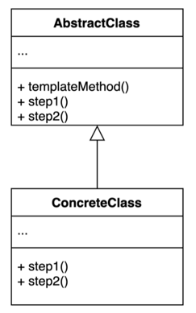
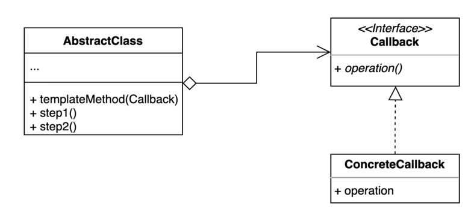

# 22. 템플릿 메서드 (Template Method) 패턴

- 알고리즘 구조를 서브 클래스가 확장할 수 있도록 템플릿으로 제공하는 방법.
- 추상 클래스는 템플릿을 제공하고 하위 클래스는 구체적인 알고리즘을 제공한다.



## 구현 방법

```java
// AbstractClass
public abstract class AbstractClass {
  
  public void execute() {
    step1();
    templateMethod();
    step2();
  }

  public void step1() { ... }
  public void step2() { ... }
  
  protected abstract void templateMethod();
  
}

// ConcreteClass 1
public class ConcreteClass1 extends AbstractClass {
  
  @Override
  protected void templateMethod() {
    // do something...
  }
  
}

// ConcreteClass 2
public class ConcreteClass2 extends AbstractClass {

  @Override
  protected void templateMethod() {
    // do something...
  }

}
```

```java
public static void main(String[] args) {
    AbstractClass concrete1 = new ConcreteClass1();
    AbstractClass concrete2 = new ConcreteClass2();

    concrete1.execute();
    concrete2.execute();
}
```

## 장단점

### 장점

- 템플릿 코드를 재사용하고 중복 코드를 줄일 수 있다.
- 템플릿 코드를 변경하지 않고 상속을 받아서 구체적인 알고리즘만 변경할 수 있다.

### 단점

- 리스코프 치환 원칙을 위반할 수도 있다.
  - sub class 에서 동작을 변경할수있기 때문 
- 알고리즘 구조가 복잡할 수록 템플릿을 유지하기 어려워진다.

## 사용하는곳

- Java, HttpServlet
- Spring
  - 템플릿 메서드 패턴: Security 설정과 같은 Configuration
  - 템플릿 콜백 패턴: JdbcTemplate, RestTemplate

## 템플릿 콜백 (Template-Callback) 패턴

- 상속 대신 익명 내부 클래스 또는 람다 표현식을 활용할 수 있다.
- 전략 패턴과 거의 유사하며 전략을 익명 내부 클래스 또는 람다 표현식으로 사용하는것만 차이가 있다.
  - ConcreteCallback 을 만들지 않고 익명 내부 클래스 또는 람다 표현식을 사용하면 된다.


