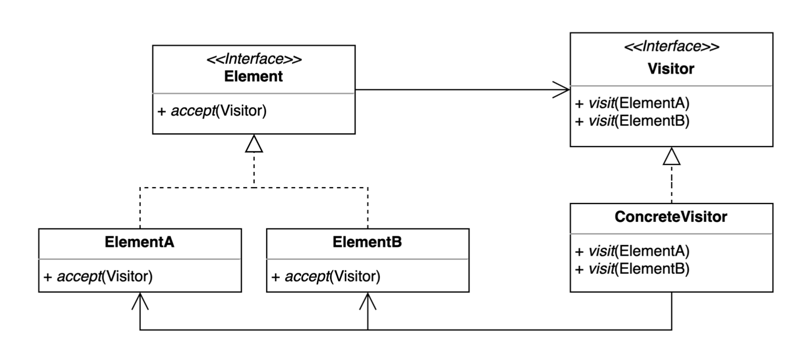

# 23. 방문자 (Visitor) 패턴

- 기존 코드를 변경하지 않고 새로운 기능을 추가하는 방법.
- 더블 디스패치 (Double Dispatch)를 활용할 수 있다.
- 알고리즘을 객체 구조에서 분리시키는 디자인 패턴이다.
  - 실제 로직을 가지고 있는 객체(Visitor)가 로직을 적용할 객체(Element)를 방문하면서 실행된다.
- Element 가 추가될 가능성이 적고 Visitor 추가가 흔할 경우 유용하다.



## 구현 방법

```java
// Element
public interface Shape {
  void accept(Device device);
}

// Element A

public class Triangle implements Shape {
  @Override
  public void accept(Device device) {
    device.print(this);
  }
}

// Element B
public class Rectangle implements Shape {
  @Override
  public void accept(Device device) {
    device.print(this);
  }
}

// Visitor
public interface Device {
  void print(Rectangle rectangle);
  void print(Triangle triangle);
}

// ConcreteVisitor 1
public class Phone implements Device {

  @Override
  public void print(Rectangle rectangle) {
    System.out.println("Print Rectangle to Phone");

  }

  @Override
  public void print(Triangle triangle) {
    System.out.println("Print Triangle to Phone");
  }
  
}

// ConcreteVisitor 2
public class Pad implements Device {
  
  @Override
  public void print(Rectangle rectangle) {
    System.out.println("Print Rectangle to Pad");
  }

  @Override
  public void print(Triangle triangle) {
    System.out.println("Print Triangle to Pad");
  }
  
}
```

```java
public static void main(String[] args) {
  Shape triangle = new Triangle();
  Device phone = new Phone();
  triangle.accept(phone);

  Shape rectangle = new Rectangle();
  Device pad = new Pad();
  rectangle.accept(pad);
}
```

## 장단점

### 장점

- 기존 코드를 변경하지 않고 새로운 코드를 추가할 수 있다.
- 추가 기능을 한 곳에 모아둘 수 있다.

### 단점

- 복잡하다.
- 새로운 Element 를 추가하거나 제거할 때 모든 Visitor 코드를 변경해야 한다.

## 사용하는곳

- Java FileVisitor, SimpleFileVisitor, AnnotationValueVisitor ElementVisitor
- Spring BeanDefinitionVisitor
